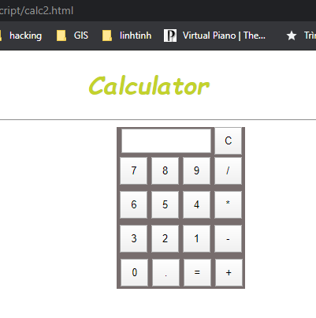

# vinagit_webgis_class
Vinagit WebGIS class

## Buổi 4

### Nội dung

* 06 dtlong - Javascript.pdf
* Bài tập calc

### Demo

> `t1.html`

https://vinagit.github.io/vinagit_webgis_class/buoi_04/javascript/t1.html

> `t2.html`

https://vinagit.github.io/vinagit_webgis_class/buoi_04/javascript/t2.html

> `t3.html`

https://vinagit.github.io/vinagit_webgis_class/buoi_04/javascript/t3.html

> Calculator JS 1

https://vinagit.github.io/vinagit_webgis_class/buoi_04/javascript/calc1.html

> Calculator JS 2

https://vinagit.github.io/vinagit_webgis_class/buoi_04/javascript/calc2.html

### Tools

